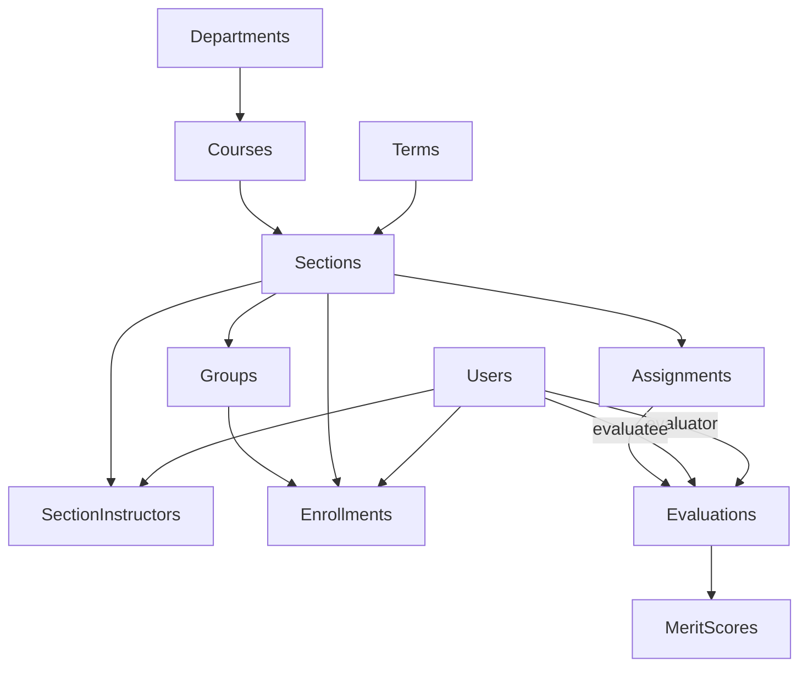

# PeerEval 🎓

A comprehensive peer evaluation system built with Django for academic institutions. PeerEval enables instructors to create and manage peer evaluation assignments where students evaluate their teammates' contributions in group projects.

[](https://python.org)
[](https://djangoproject.com)
[](https://postgresql.org)
[](https://docker.com)
[](https://opensource.org/licenses/MIT)
[](https://discord.gg/Ag9TQfMn4X)

## 🌟 Features

### For Instructors
- **Course & Section Management**: Organize courses by departments with multiple sections per term
- **Student Enrollment**: Bulk import/export student rosters with Brightspace integration
- **Group Formation**: Flexible group assignment with various formation methods
- **Assignment Creation**: Configure peer evaluation assignments with custom point scales
- **Merit Scoring**: 5-point Likert scale evaluations across key teamwork dimensions:
  - Work Contribution
  - Team Interaction
  - Team Awareness
  - Quality of Work
  - Knowledge and Skills
- **Real-time Analytics**: Track evaluation progress and completion rates
- **Grade Export**: Export evaluation results for gradebook integration

### For Students
- **Intuitive Interface**: Clean, responsive UI built with DaisyUI/Tailwind CSS
- **Self & Peer Evaluation**: Evaluate own work and teammates' contributions
- **Progress Tracking**: View assignment deadlines and submission status
- **Secure Access**: Session-based authentication with rate limiting

### System Features
- **Multi-tenant Architecture**: Support multiple departments and institutions
- **Role-based Access**: Separate dashboards for instructors and students
- **Automated Backups**: Built-in backup system for configuration files
- **Auto-updates**: Continuous deployment from GitHub with zero-downtime updates
- **Containerized Deployment**: Docker Compose setup for easy deployment

## 🗄️ Database Architecture

The PeerEval system uses a comprehensive relational database design that models the complete academic hierarchy and peer evaluation workflow. Built on PostgreSQL 17, the schema supports multi-institutional deployments with role-based access control.

### Core Models Overview

#### **Users Model** (`app/src/models.py:6-14`)
Extends Django's AbstractUser with academic-specific functionality:
```python
class Users(AbstractUser):
    is_instructor = models.BooleanField(default=False)
```
- **Purpose**: Unified authentication for students and instructors
- **Key Features**: Role-based access through `is_instructor` flag
- **Relationships**: Central to all user-related operations

#### **Academic Hierarchy Models**

**Terms** (`app/src/models.py:16-27`)
```python
class Terms(models.Model):
    name = models.CharField(max_length=16)  # "Spring 2025"
    start_date = models.DateField()
    end_date = models.DateField()
```
- **Purpose**: Define academic periods (semesters, quarters)
- **Business Logic**: Controls when sections are considered "active"

**Departments** (`app/src/models.py:29-39`)
```python
class Departments(models.Model):
    id = models.CharField(max_length=16, primary_key=True)  # "CS", "ENGL"
    name = models.CharField(max_length=50)
    department_head = models.ForeignKey(Users, limit_choices_to={'is_instructor': True})
```
- **Purpose**: Organizational units with course prefixes
- **Key Feature**: Department heads must be instructors (constraint enforced)

**Courses** (`app/src/models.py:41-53`)
```python
class Courses(models.Model):
    course_code = models.CharField(max_length=16)  # "101", "17600"
    name = models.CharField(max_length=50)
    department = models.ForeignKey(Departments)
    coordinator = models.ForeignKey(Users, limit_choices_to={'is_instructor': True})
```
- **Purpose**: Course catalog with department prefixes
- **Display**: Combines as "CS101 (Introduction to Computer Science)"

**Sections** (`app/src/models.py:55-96`)
```python
class Sections(models.Model):
    course = models.ForeignKey(Courses, related_name='sections')
    section_number = models.CharField(max_length=6)
    term = models.ForeignKey(Terms)
```
- **Purpose**: Specific instances of courses in terms
- **Advanced Features**: 
  - `get_active_sections_for_instructor()`: Time-aware section filtering
  - `get_past_sections_for_instructor()`: Historical section access
- **Performance**: Uses `select_related()` for optimized queries

#### **User Relationship Models**

**SectionInstructors** (`app/src/models.py:98-111`)
```python
class SectionInstructors(models.Model):
    section_id = models.ForeignKey(Sections)
    user_id = models.ForeignKey(Users, limit_choices_to={'is_instructor': True})
```
- **Purpose**: Many-to-many relationship between instructors and sections
- **Flexibility**: Multiple instructors per section, instructors can teach multiple sections

**Enrollments** (`app/src/models.py:126-158`)
```python
class Enrollments(models.Model):
    user_id = models.ForeignKey(Users)
    section_id = models.ForeignKey(Sections, related_name='enrollments')
    group = models.ForeignKey(Groups, null=True, blank=True)
    enrollment_date = models.DateTimeField(auto_now_add=True)
```
- **Purpose**: Student-section relationships with group assignments
- **Advanced Features**: Time-based enrollment tracking
- **Business Logic**: `get_active_students_for_section()` for current students

**Groups** (`app/src/models.py:113-124`)
```python
class Groups(models.Model):
    name = models.CharField(max_length=50)
    section_id = models.ForeignKey(Sections)
    created_at = models.DateTimeField(auto_now_add=True)
```
- **Purpose**: Team organization within sections
- **Flexibility**: Students can be assigned to groups for collaborative evaluation

#### **Evaluation System Models**

**Assignments** (`app/src/models.py:161-242`)
The most complex model with sophisticated business logic:
```python
class Assignments(models.Model):
    section_id = models.ForeignKey(Sections, related_name='assignments')
    name = models.CharField(max_length=50)
    available_date = models.DateTimeField()
    due_date = models.DateTimeField()
    max_points_self = models.IntegerField(default=100)
    max_points_partner = models.IntegerField(default=120)
    self_eval = models.BooleanField(default=True)
    enable_merits = models.BooleanField(default=True)
```

**Advanced Assignment Features**:
- **Point Distribution Logic**: `get_evaluations_total_for_user()` prevents point inflation
- **Group-Aware Scoring**: `get_max_points_for_group()` calculates total allowable points
- **Dynamic Constraints**: Maximum points scale with group size
- **Time-Based Activation**: `is_active` property for assignment availability

**Evaluations** (`app/src/models.py:244-258`)
```python
class Evaluations(models.Model):
    evaluator_id = models.ForeignKey(Users, related_name='evaluations_given')
    evaluatee_id = models.ForeignKey(Users, related_name='evaluations_received')
    assignment_id = models.ForeignKey(Assignments)
    points = models.IntegerField()
    comments = models.TextField()
    submission_date = models.DateTimeField(auto_now_add=True)
```
- **Purpose**: Core peer evaluation records
- **Bidirectional**: Users can both give and receive evaluations
- **Audit Trail**: Automatic timestamp tracking

**MeritScores** (`app/src/models.py:260-274`)
```python
class MeritScores(models.Model):
    evaluation_id = models.ForeignKey(Evaluations)
    score_workcontribution = models.IntegerField(validators=[MinValueValidator(1), MaxValueValidator(5)])
    score_teaminteraction = models.IntegerField(validators=[MinValueValidator(1), MaxValueValidator(5)])
    score_teamawareness = models.IntegerField(validators=[MinValueValidator(1), MaxValueValidator(5)])
    score_qualityofwork = models.IntegerField(validators=[MinValueValidator(1), MaxValueValidator(5)])
    score_knowledgeandskills = models.IntegerField(validators=[MinValueValidator(1), MaxValueValidator(5)])
```
- **Purpose**: Detailed Likert scale scoring across teamwork dimensions
- **Validation**: Enforced 1-5 scale through model validators
- **Research-Based**: Five dimensions cover comprehensive teamwork assessment

### Relationships and Data Flow



### Performance Optimizations

1. **Query Optimization**: Models use `select_related()` and `prefetch_related()` for efficient database access
2. **Indexed Foreign Keys**: All relationships properly indexed for fast joins  
3. **Computed Properties**: Time-based filtering methods reduce redundant database queries
4. **Constraint Validation**: Database-level constraints prevent invalid data states

### Data Integrity Features

- **Cascading Deletes**: Proper cleanup when sections or courses are removed
- **Role Constraints**: `limit_choices_to` ensures only instructors can be assigned instructor roles
- **Validation Rules**: Merit scores constrained to valid 1-5 range
- **Audit Trails**: Automatic timestamping on critical models

## 🚀 Quick Start

### Prerequisites
- Docker and Docker Compose
- Git

### Installation

1. **Clone the repository**
```bash
git clone https://github.com/ItzPabz/PeerEval.git
cd PeerEval
```

2. **Set up environment variables**
```bash
cp .env.example .env
# Edit .env with your database credentials
```

3. **Launch with Docker Compose**
```bash
docker-compose up -d
```

4. **Create initial admin user**
```bash
docker exec -it peereval-web python manage.py createadmin
```

5. **Access the application**
- Application: http://localhost:8000
- Admin Panel: http://localhost:8000/admin

### Manual Setup (Development)

1. **Create virtual environment**
```bash
cd app
python -m venv venv
source venv/bin/activate  # On Windows: venv\Scripts\activate
```

2. **Install dependencies**
```bash
pip install -r requirements.txt
```

3. **Configure database**
```bash
# Set up PostgreSQL database and update settings.py
python manage.py migrate
```

4. **Create superuser**
```bash
python manage.py createsuperuser
```

5. **Run development server**
```bash
python manage.py runserver
```

## 📋 Usage Guide

### Setting Up Your Institution

1. **Configure Institution Settings**
   - Update `INST_NAME` and `INST_SHORT_NAME` in settings.py
   - Set up departments and course prefixes

2. **Create Academic Terms**
   - Define semester/quarter periods with start and end dates
   - Terms control when sections are active

3. **Add Courses and Sections**
   - Create courses under appropriate departments
   - Set up sections for specific terms
   - Assign instructors to sections

### Managing Evaluations

1. **Create Assignments**
   - Set availability and due dates
   - Configure point scales for self and peer evaluation
   - Enable/disable merit scoring as needed

2. **Organize Students into Groups**
   - Use various group formation methods
   - Groups can be created manually or through automated processes

3. **Monitor Progress**
   - Track evaluation completion rates
   - View detailed analytics on student participation

## 🐳 Docker Configuration

The application runs in two containers:

### Web Container (`peereval-web`)
- Python 3.13.3 with Django application
- Gunicorn WSGI server (3 workers, 120s timeout)
- Automatic updates from GitHub every hour
- Volume mount for development: `./app:/app`

### Database Container (`peereval-db`)
- PostgreSQL 17 with health checks
- Persistent storage: `./db:/var/lib/postgresql/data`
- Automated backup system

### Key Features:
- **Zero-downtime updates**: Automatic git pulls with file backups
- **Health monitoring**: PostgreSQL health checks ensure database availability
- **Development friendly**: Live reload with volume mounts

## ⚙️ Configuration

### Environment Variables
```bash
POSTGRES_DB=peereval
POSTGRES_USER=peereval_user  
POSTGRES_PASSWORD=secure_password
DB_HOST=db
DB_PORT=5432
```

### Django Settings Highlights
- **Session Security**: 30-minute timeout, secure cookies
- **Custom User Model**: Extended with instructor/student roles
- **Brightspace Integration**: Enable/disable LMS compatibility
- **Time Zone**: Configurable (default: America/New_York)
- **Static Files**: Automated collection and serving

### Security Features
- Rate limiting on login attempts (5 attempts per 5 minutes)
- CSRF protection enabled
- Secure session management
- SQL injection protection through Django ORM

## 🧪 Development

### Project Structure
```
PeerEval/
├── app/                    # Django application
│   ├── peereval/          # Project configuration
│   ├── src/               # Main application code
│   │   ├── models.py      # Database models
│   │   ├── views.py       # View logic
│   │   ├── forms.py       # Django forms
│   │   ├── templates/     # HTML templates
│   │   └── static/        # CSS/JS assets
│   ├── manage.py          # Django management
│   └── requirements.txt   # Python dependencies
├── docker-compose.yml     # Container orchestration
├── Dockerfile            # Container definition
└── restart.sh           # Utility script
```

### Key Components

**Models** (`app/src/models.py:1-275`)
- Complete academic hierarchy from institutions to individual evaluations
- Optimized queries with select_related for performance
- Business logic methods for active/past sections

**Views** (`app/src/views.py:1-50`)
- Role-based dashboards for instructors and students
- Search and pagination functionality
- Rate limiting and security controls

**Templates**
- Cotton components for consistent UI elements
- Responsive design with DaisyUI
- Separate workflows for instructors and students

### Management Commands
```bash
# Create admin user
python manage.py createadmin

# Clean test data
python manage.py cleandata

# Run migrations
python manage.py migrate

# Collect static files
python manage.py collectstatic
```

## 🤝 Contributing

1. Fork the repository
2. Create a feature branch (`git checkout -b feature/amazing-feature`)
3. Make your changes
4. Test thoroughly
5. Commit your changes (`git commit -m 'Add amazing feature'`)
6. Push to the branch (`git push origin feature/amazing-feature`)
7. Open a Pull Request

### Development Guidelines
- Follow Django best practices
- Maintain test coverage
- Use meaningful commit messages
- Update documentation for new features

## 📝 License

This project is licensed under the MIT License - see the [LICENSE](LICENSE) file for details.

## 🔧 Troubleshooting

### Common Issues

**Database Connection Error**
```bash
# Check if containers are running
docker-compose ps

# View logs
docker-compose logs db
docker-compose logs web
```

**Permission Denied**
```bash
# Make entrypoint script executable
chmod +x app/entrypoint.sh
```

**Static Files Not Loading**
```bash
# Collect static files
docker exec -it peereval-web python manage.py collectstatic --noinput
```

### Health Checks
- Database: `docker exec -it peereval-db pg_isready -U peereval_user -d peereval`
- Web Application: Visit http://localhost:8000/admin

## 📞 Support

For issues and questions:
1. Check the [Issues](https://github.com/ItzPabz/PeerEval/issues) page
2. Create a new issue with detailed information
3. Include logs and environment details

## 🙏 Acknowledgments

- Django community for the excellent web framework
- DaisyUI for the beautiful component library  
- Cotton for reusable Django template components
- PostgreSQL team for the robust database system

---

**Built with ❤️ for academic institutions worldwide**